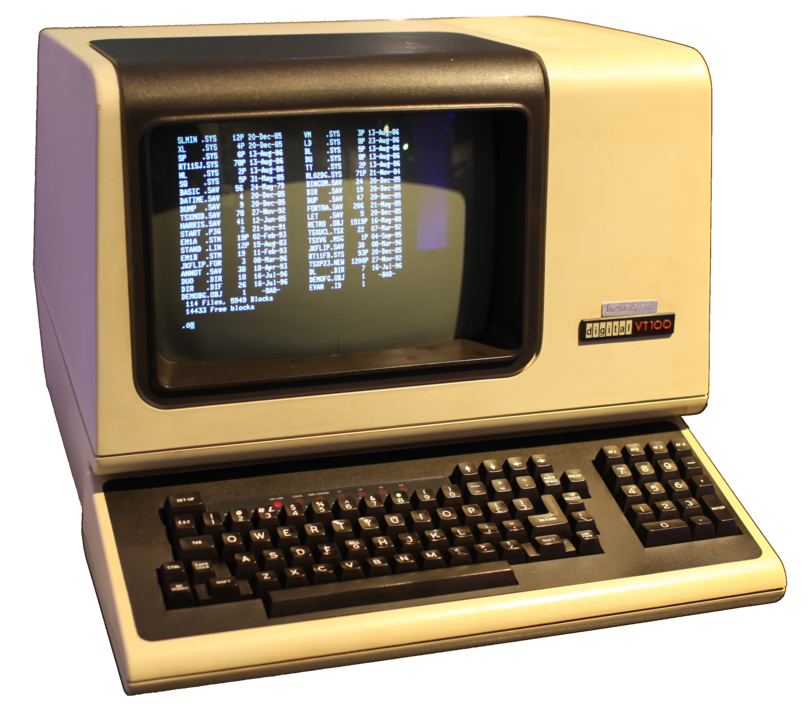
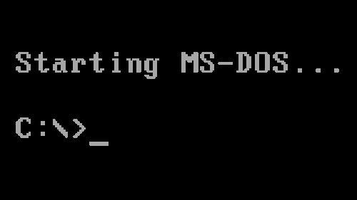

# Chapter 1.0 - Terminals, shells, directories

This chapter shows you how to navigate in the shell. It explains what a shell is, how it evolved to what it is today, and gives you a little bit of trivia and history about terminals.

[TOC]

## Terminals
Older computers where big mainframe systems filling entire rooms. Multiple users could operate those machines simultaneously using terminals. Initially these consisted of electronic typewriters with attached keyboards.

.png)

Due to these origins, a lot of terms regarding command-line interfaces still refer to elements of typewriters. For example the control-character for advancing to the next line is called "new line" on unix-like systems. In Windows, advancing to the next line requires two characters: carriage return followed by a new line, resembling the two motions a physical typewriter needs to perform to go to the beginning of the next line.

As technology evolved, those typewriters were replaced by screens.



These so called visual display units (VDUs) offered new possibilities.

Text displayed could easily be erased and overwritten. Buttons for deleting the last character (backspace) or the current character (delete) where added.

The latest text displayed to the user was no longer hidden by a clunky mechanical typing device. So the current position of where new text will appear on the screen now somehow had to be shown to the user. Thus the cursor was invented.



It was now possible to move the cursor around the screen, so cursor keys where added to the keyboard.

These VDUs still didn't have internal processing power as the computers where still very large, clunky and expensive. It was with the invention of the microchip that computers started to become small and inexpensive enough to put them on or under desks and viable to be used by a single person at a time.

Today, computer software emulates those VDU terminals in terminal emulators. One of those is gnome-terminal, which is the terminal you get when you press <ctrl>+<alt>+<t> on an ubuntu system.


## shells

A shell is a computer program that exposes an operating system's services to a human user or other programs. In general, operating system shells use either a command-line interface (CLI) or graphical user interface (GUI), depending on a computer's role and particular operation. It is named a shell because it is the outermost layer around the operating system.

In most cases, this term is referring to a command-line interface.
Command-line interfaces are typically accessed via a terminal emulator.

The shell prompts the user for entering commands and executes them. Once the program is finished, the shell shows it's prompt again, awaiting further user input.

In unix like operating systems, the most commonly used shell nowadays is bash (Bourne Again SHell). There are other shells as well (ksh, csh, zsh) to name only a few but throughout this course we will be using bash, which is also the default shell for Ubuntu and macos. 

### The prompt

The prompt is the shell informing you that it is ready to receive commands from you. In it's most basic form it is just a single character.

```plaintext
$
```

But the prompt could also be used to convey additional information to the user.
In ubuntu the default prompt looks like this:

```plaintext
nomike@max:~/coding/nomikes_python_challenges$ 
```

#### nomike

This is the name of the currently logged in user.

#### max

The part after the @ symbol shows the name of the computer.

#### ~/coding/nomikes_python_challenges

This part shows the current directory you are in. Sometimes they are also called folders (you will understand much later why both terms exist).

As with physical folders in a filing cabinet, a folder can contain multiple items which can be nested folders or files (in IT, a lot of terminology is borrowed from real life physical analogies).

#### $

This is what originally was referred to as the "prompt". The "$" character is the prompt shown when you are logged in as a regular user. If you are logged in as a super-user or root (a user which has more privileges and can thus do more damage) this symbol usually changes to "#", to tell you that you need to be more cautious about what you're doing.

### The working directory

Whenever you are in the shell, you are in a certain directory.
If you are unsure in which directory you currently are and your prompt is configured in a way to not show this, you can use the `pwd` (print working directory) command:

```plaintext
nomike@max:~/coding/nomikes_python_challenges$ pwd
/home/nomike/coding/nomikes_python_challenges
```
### Listing files in the working directory

The `ls` (list command) lists what's in the working directory:

```plaintext
nomike@max:~/coding/nomikes_python_challenges$ ls
chapters  glossary.md  LICENSE  readme.md
```

The `ls` command also supports parameters to change it's behavior. This for example gives a more detailed ("long") listing of the directory:

```plaintext
nomike@max:~/coding/nomikes_python_challenges$ ls -l
total 48
drwxrwxr-x 3 nomike nomike  4096 Nov 24 22:56 chapters
-rw-rw-r-- 1 nomike nomike 35149 Sep 30  2017 LICENSE
-rw-rw-r-- 1 nomike nomike   113 Nov 24 22:55 index.md
```

showing file sizes, modification timestamps and various other info.
For example note the "d" character in the first column, which signifies that the item is a directory.

### Moving down the hierarchy
You can change the working directory to be inside a subdirectory using the `cd` (change directory) command:

```plaintext
nomike@max:~/coding/nomikes_python_challenges$ cd chapters
nomike@max:~/coding/nomikes_python_challenges/chapters$ 
```

Notice how this changed the prompt.

### Moving back out
There are actually two hidden items in (almost) every directory:

#### .
This is a shortcut which refers to the current directory.

#### ..
This is a shortcut which refers to the parent directory.

So by combining the knowledge you gained so far, you can use

```plaintext
nomike@max:~/coding/nomikes_python_challenges/chapters$ cd ..
nomike@max:~/coding/nomikes_python_challenges$ 
```
to move back to the directory you came from.

### Creating and deleting directories

The command `mkdir` can be used to create directories:

```plaintext
nomike@max:~/coding/nomikes_python_challenges$ mkdir foo
nomike@max:~/coding/nomikes_python_challenges$ ls -l
total 52
drwxrwxr-x 3 nomike nomike  4096 Nov 24 22:56 chapters
drwxrwxr-x 2 nomike nomike  4096 Nov 24 23:52 foo
-rw-rw-r-- 1 nomike nomike  2295 Nov 24 23:22 glossary.md
-rw-rw-r-- 1 nomike nomike 35149 Sep 30  2017 LICENSE
-rw-rw-r-- 1 nomike nomike   113 Nov 24 22:55 readme.md
```

To get rid of it, use the `rmdir` command:

```plaintext
nomike@max:~/coding/nomikes_python_challenges$ rmdir foo
```

### Creating empty files

There is a tool called `touch` which set's the date a file or directory was last modified to now. If the file specified does not exist, it creates an empty one:

```plaintext
nomike@max:~/coding/nomikes_python_challenges$ touch bar
nomike@max:~/coding/nomikes_python_challenges$ ls -l
total 48
-rw-rw-r-- 1 nomike nomike     0 Nov 24 23:55 bar
drwxrwxr-x 3 nomike nomike  4096 Nov 24 22:56 chapters
-rw-rw-r-- 1 nomike nomike  2295 Nov 24 23:22 glossary.md
-rw-rw-r-- 1 nomike nomike 35149 Sep 30  2017 LICENSE
-rw-rw-r-- 1 nomike nomike   113 Nov 24 22:55 readme.md
nomike@max:~/coding/nomikes_python_challenges$ 
```

Notice the "0" next to the new file. That's the filesize, measured in bytes.

### Removing files

Files can be removed with the `rm` command:

```plaintext
nomike@max:~/coding/nomikes_python_challenges$ rm bar
```

Continue now with the exercise.
