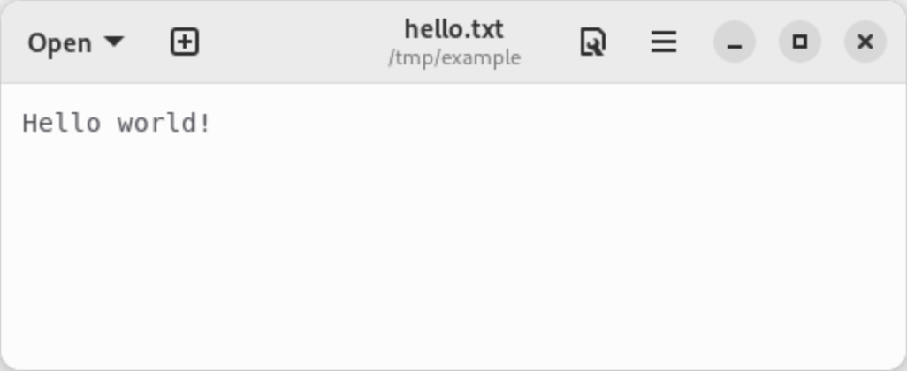
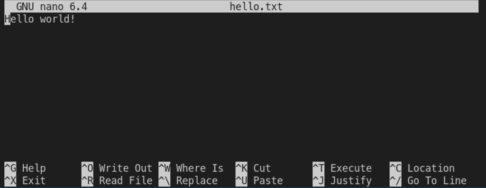
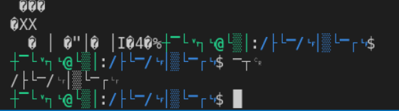

# Chapter 1.2 - Viewing, creating and editing files

In this chapter you will learn how to create files and about how to view and change their contents.

[TOC]

## Creating empty files

One way to create an empty file (or to be more precise: to ensure that a file exists) is using the `touch` command which we have used in the previous chapters already:

```plaintext
nomike@max:/tmp/example$ touch foo.txt
```

## Showing the contents of a file

### cat

`cat` is a simple command for printing file contents to the screen (the name comes from concatenate). It takes multiple paths as parameters and prints the contents of those files to your terminal:

```plaintext
nomike@max:/tmp/example$ cat hello.txt 
Hello world!
nomike@max:/tmp/example$ cat file.txt 
Great, I'm a file!
nomike@max:/tmp/example$ cat hello.txt file.txt 
Hello world!
Great, I'm a file!
```

### more

If a file is large, it will not fit on your screen and you will only be able to see the bottom part of it.

Try running this for example:

```plaintext
cat /etc/group
```

The `more` command, prints file contents until the screen is fulled.

```plaintext
more /etc/group
```

You can then use the space key to advance to have the screen filled with the next lines. If you use the enter key, only one line is printed to the bottom of your terminal and the previous lines are moved up by one line.

If you want to exit the program simply type "q".

### less

Originally `more` only allowed you to move forward within a file (but features like that have been added to it since then).
The `less` command was introduced to also allow you to move backwards. It also adds a lot of nice features like searching for text within a file.

```plaintext
less /etc/group
```

To exit, simply type "q" again.

Nowadays `more` is hardly used as everybody has switched to the more advanced `less` program.

## Editing files

If you want to change the contents of a file you could use an editor.

You could use `gnome-text-editor` for example:

```plaintext
gnome-text-editor hello.txt
```



This might look like a familiar convenient user interface, but as you can see, we are not in our terminal anymore until we close the editor. Software like this typically requires you to use your mouse which, as you might have noticed, wasn't necessary at all so far when navigating in the shell.

Because of this, it is usually preferred to use a terminal based text editor.

There is a variety of options available: vi, vim, emacs, joe to only name a few. These sometimes offer tons of features and flexibility but at the cost of complexity.

### nano

At the beginning, you might want to use `nano` though, which is an easy to use text editor. It might not be as feature rich as vi or emacs, but it does the job quite well ([XKCD: 378: Real Programmers](https://www.explainxkcd.com/wiki/index.php/378:_Real_Programmers)).



At the bottom of the screen, you can see a list of commands. These are preceded by a '^' which is also called a caret-symbol. A caret-symbol usually indicates that you need to press and hold the control key, usually labeled "ctrl" on english keyboard (or "Strg" which stands for "Steuerung" on german keyboards), while pressing the other key indicated.

So to exit you would press ctrl+x, to open the help you would press ctrl-g, and so on.

If you made changes to the file which is currently open, `nano` will ask you whether you want to save those changes when you're exiting it.

## Garbling your terminal

Terminals use certain control characters to change their behavior. While programs like `less` and `nano` take care of not messing things up, the `cat` command just prints everything to the terminal as-is.

If you try to print a binary-file to the screen, which is not what binary files are being supposed to, your terminal might wrongly interpret certain binary sequences of that file as control characters and change it's behavior.

If I run `cat /usr/bin/ls` for example, my prompt will look weird and even the stuff that I type is unreadable:



To reset the terminal to a usable state, simply use the `reset` command.

***Note:** As you currently can't read what's on your screen, you have to type this blindly, trust that you didn't make a typo and press enter. If you are unsure about that, press ^c to clear the prompt and try again.*

This will clear the screen, and you will be presented with a nice looking prompt.

Go give it a try!
